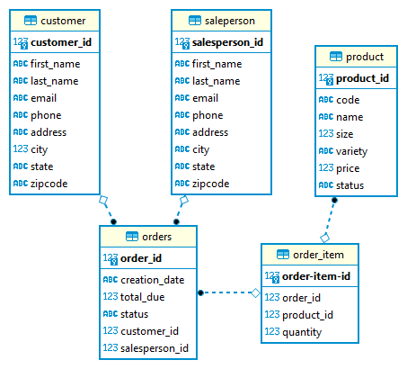

# Introduction
Java Database Connectivity(JDBC) is a standard application programming interface(API), which allows the java program access to the database management system. I used IntelliJ IDE and utilized Maven, which is chiefly used for java based projects for managing packages and dependencies. PostgreSQl databade is used to persist data into database instance after runing the Docker container. I implimented a data access object(DAO) that CRUD on object in the project(DTO).
# Implementaiton
I created a new database ion psql instance by executing several SQL scripts. Then created and collected data on the tables in the database.
```
	# Create a database
	psql -h localhost -U postgres -f database.sql
	
	# Access the jdbc_db database
	psql -h localhost -U postgres -d hplussport
	
	# Create tables and populate tables with data
	psql -h localhost -U postgres -d hplussport -f customer.sql
	psql -h localhost -U postgres -d hplussport -f product.sql
	psql -h localhost -U postgres -d hplussport -f salesperson.sql
	psql -h localhost -U postgres -d hplussport -f orders.sql
```


## ER Diagram

## Design Patterns
### DAO Design Pattern
The Data Access Object (DAO) pattern is a structural pattern that allows us to isolate the application/business layer from the persistence layer using an abstract API.
In this project, DataAccessObject was created for implementing its domain model (Customer and Order).
It is a plain container for data.
DOA interface performs CRUD operations on objects.  
DataAccessObject was extended by CustomerDAO and OrderDAO classes that are called to perform CRUD operations related to the Customer and Order model (DTO).

### Repository Design Pattern
The repository is one of the important design patterns that can be used when we need a layer to deal with data access whether this data is in a database or another storage.
It is Between domains(entity) and Data Storage. It prevents duplicate query and is used for searching or removing elements using the specification of the entity that the repository was created for.

# Test
I executed the bash script to check the status of the Docker container and then start the psql instance.

Testing implemented methods in the JDBCEXecuter class.
I manually created ,read , updated and deleted data (CRUD).