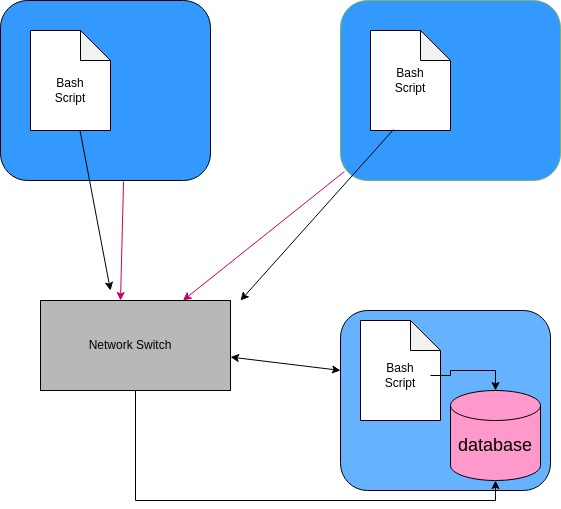

# Linux Cluster Monitoring Agent

Linux clustering gathers several servers/nodes ,which are connected together through a switch. The Linux Cluster Administration(LCA) team needs the hardware specifications and source usage of each node . Monitoring agent collects these data by executing its bash scripts and stores the data into the database. Crontab collects and saves data usage continuously in PostgresSQL instance in docker container.

# Quick Start
Use markdown code block for your quick-start commands
- Start a psql instance using psql_docker.sh
```
./scripts/psql_docker.sh start
```
- Create tables using ddl.sql
``` 
psql -h localhost -U postgres -d host_agent -f sql/ddl.sql
```
- Insert hardware specs data into the DB using host_info.sh
``` 
./scripts/host_info.sh psql_host psql_port db_name psql_user psql_password
```
- Insert hardware usage data into the DB using host_usage.sh
```
./scripts/host_usage.sh psql_host psql_port db_name psql_user psql_password
```
- Crontab setup
``` 
crontab -e

#add this line to crontab
* * * * * bash /path/to/linux_sql/scripts/host_usage.sh localhost 5432 host_agent postgres password > /tmp/host_usage.log
```

# Implemenation
- First of all, I created a psql instance by using docker container.
- Creating host_info and host_usage tables in the host_agent database
- Collecting hardware specifications and source usage by executing host_info.sh and host_usage.sh bash scripts,respectively.Then persisting the collected information into the database.
- Finally, using crontab the usage data is collected every minute and the monitoring app is deployed.
## Architecture


## Scripts
- psql_docker.sh
```
./scripts/psql_docker.sh start|stop|create [db_username][db_password]

# create an instance
./scripts/psql_docker.sh create db_username db_password

#start the instance
./scripts/psql_docker.sh start

#stop the instance
./scripts/psql_docker.sh stop
```
- host_info.sh`
```
./scripts/host_info.sh psql_host psql_port db_name psql_user psql_password
```
- host_usage.sh
``` 
./scripts/host_usage.sh psql_host psql_port db_name psql_user psql_password
```
- crontab
``` 
# edit crontab job
crontab -e

# add this line to crontab, create a crontab job
* * * * * bash /path/to/linux_sql/scripts/host_usage.sh localhost 5432 host_agent postgres password > /tmp/host_usage.log

#list crontab jobs
crontab -l
```

## Database Modeling

- `host_info`

|Field Name	|Data Type	| Constraints      |
|-----------|-----------|------------------|
|id	|serial	| PK NOT NULL      |
|hostname	|varchar	| UNIQUE  NOT NULL |
|cpu_number	|int2	|NOT NULL|
|cpu_architecture	|varchar	|NOT NULL|
|cpu_model	|varchar	|NOT NULL|
|cpu_mhz	|float8	|NOT NULL|
|l2_cache	|int4	|NOT NULL|
|"timestamp"	|timestamp	|NULL|
|total_mem	|int4	|NULL|

- `host_usage`

  | Field Name	  | Data Type  |Constraints|  
  |------------|-----------|-----------|
  | "timestamp"	 | timestamp	 | NOT NULL   |
  | host_id	     | serial	    |FK NOT NULL|
  | memory_free	 | int4	      |NOT NULL|
  | cpu_idel	    | int2	      |NOT NULL|
  | cpu_kernel	  | int2	      | NOT NULL   |
  | disk_io	     | int4	      |NOT NULL|
  |disk_available	| int4	      |NOT NULL|

# Test
- The bash scripts were tested manually, host_info.sh and host_usage.sh was tested by checking the psql tables after execution, while psql_docker.sh was tested on the cli by checking docker container status.
- The ddl.sql was tested by querying the database tables after connecting to psql instance.

# Deployment
- Containerization of the database was done in docker, then I created a crontab job. Source code control was done using GitHub.

# Improvements
- Provide the ability to detect any host failure.
