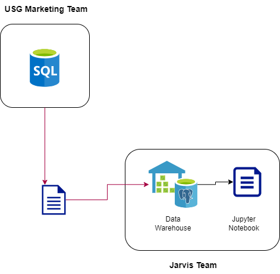

# Introduction
The project is based on the London Gift Shop (LGS), a gift shop. In order to improve sales and marketing strategies, the marketing team wants to enhance the technology.
As a Data engineer, it is my responsibility to assist LGS by examining the purchase behaviors of its customers.
By using analytics, the LGS marketing team will create focused marketing plans (such as email, events, target specials, etc.) to draw in both current and potential consumers.
I used Python, Jupyter Notebook, Pandas Dataframe, Numpy, data warehousing, and data analytics to address all business requirements.
# Implementaion
## Project Architecture
We have been given a SQL file with the transaction data from December 1, 2009, to December 9, 2011.
Once the SQL file has been imported into Datawarehouse, the data is able to be analyzed via a Jupyter Notebook.

  
## Data Analytics and Wrangling
Jupyter Notebook Link: https://github.com/Jarvis-Consulting-Group/jarvis_data_eng-Fatemeh-khaksar/blob/develop/python_data_analytics/python_data_wrangling/retail_data_analytics_wrangling.ipynb

Can't Lose Segment; clients typically shop 353 days before the current date. An average of 16 purchases have been made by customers. Customers made average purchases of £8356.

Hibernating Segment; clients' latest purchase date was 481 days prior to the norm. An average of 1 purchase was made by each customer. The typical customer spent £438.

Customers in the Champions Segment last shopped 30 days prior to the national average. Customers purchased 19 purchases on average. Customers made average purchases of GBP 10796.

Can't Lose Segment; clients in this segment have not bought anything recently. We need to develop a discount and gift campaign for this sector as a result. When they made purchases in the past, these customers bought a lot. Recency values, however, are less recent than they need to be. Both the products purchased by the clients and recommendations based on prior actions should be included in the campaign that will be run for them. This marketing can also feature fresh and well-liked items linked to the ones they were interested in. It is necessary to look into circumstances that could lead these clients to discontinue purchasing.

Customers in the hibernating section haven't bought anything in a while. But by providing discounts, they could be persuaded to make another buy.

Customers in the Champions category generate the majority of the segment's revenue. To guarantee that these clients keep purchasing, campaigns should be put into place.
# Improvements
- Customers can be divided based on their interests, and promotions can become available.
- investigate sales based on customer addresses